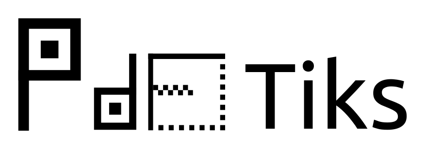
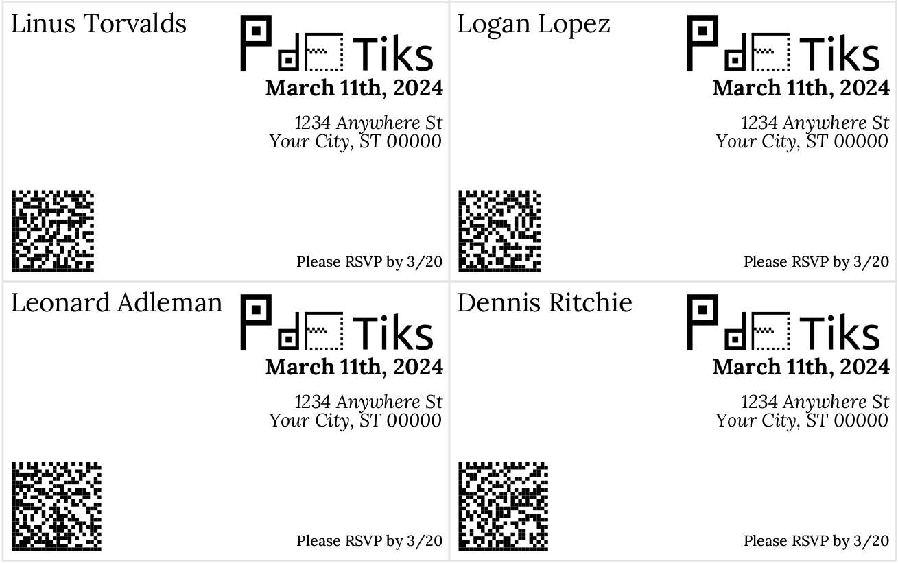
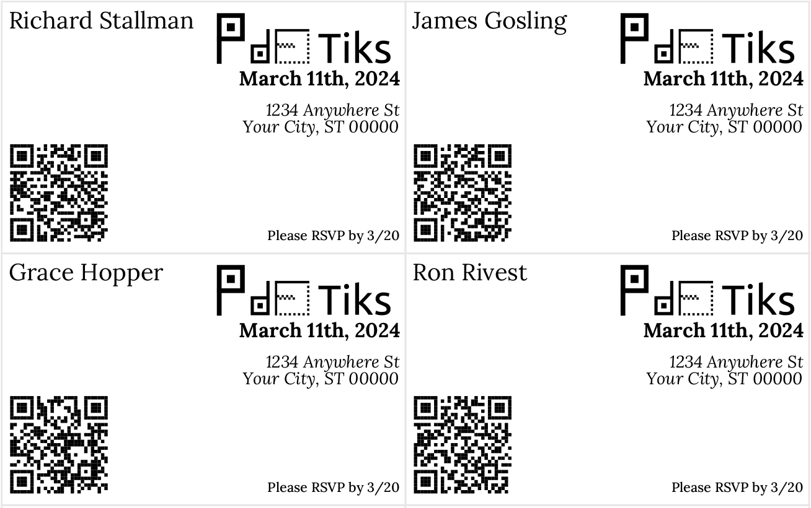

# PDFTiks

**PDFTiks** is a C++ program that will generate/output PDF tickets using libharu and libqrencode or libdmtx. This is meant to be used by a companion app that will scan the codes against a backend to check that they're still valid using UUIDs as the identifier. The tickets are expected to be distributed in some form physically, either at a previous gathering or by sending them by mail. The barcodes are made by drawing small PDF rectangles where each "module" is needed, instead of a bitmap which wouldn't be as scalable.

PDFTiks is great for generating hype around your event, and all without the exorbitant TicketMaster fees either. It is simple and scalable since it's in C++. I'd highly recommend printing it on cardstock for that extra wow factor and the fact that the tickets seems to last and scan much better that way. Tickets can easily be added with a simple text file of the attendees names. While this portion doesn't support it, columns have been added to allow for revocation and RSVP as well. You can easily configure the database as well as the fixed ticket fields in the XML file as described below.

## Dependencies
To install dependencies on a Ubuntu/Debian based system run the command below 
`sudo apt-get install -y libdmtx-dev libqrencode-dev libmysqlcppconn-dev libhpdf-dev uuid-dev`

## Configuration
Please point the *config.xml* file to a MySQL database. Your tickets will be stored in a *tickets* table. The rest of the fields are show in the layout below.

## Compiling
To compile just run `make`

To add new tickets simply run the program with the file for the names for the tickets and the rest will be handled. `./pdftiks tickets.txt`

If you have tickets already generated then just run: `./pdftiks`

Your tickets will be available on *output.pdf*

## Symbology Selection
If you'd like to change the symbology you can do so in the *main.cpp* file in the last line of the `ticketPrinter` function that will be `hpdf_SYMBOLOGY`. It is set to Data Matrix (dmtx) by default because that seems to be the most compact and easiest to read. You can view the symbology options in the *hpdf_barcode.h* file. **The PDF417 is not currently working, nor recommended due to its size.**

## What was this for?
I used this to celebrate the publishing of my [patent](https://patents.google.com/patent/US11320838B2/) (which I called my Patent Party) and generated hype (and kept out unwanted guests) by making tickets and printing them on cardstock. I handed them out at my birthday (finished the code as people were coming and took everyone on an impromptu trip to Kinkos) and mailed the rest. I realized with postage prices this can get *very expensive* (but I had a roll of stamps) and my friends complained that it wasn't an "e-ticket" so I made a Flask version with Twilio at a later date.

## Acknowledgements
 * The font used is [Lora](https://fonts.google.com/specimen/Lora) which is from Google Fonts
 * [pdf417lib](https://sourceforge.net/projects/pdf417lib/) is from psoares33 on SourceForge

## Licensing
This program is published under GPLv3.
